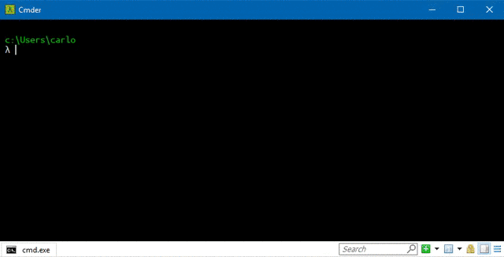

# Marlin

Swim between bookmarks in the terminal!

    

Marlin is an easy to use bookmark manager for the terminal. Choose a folder, bookmark it and swim there whenever you want!

## Usage

    pip install marlin-bookmark

### Bookmark

    bookmark [bookmark-name]

### Remove a Bookmark

    rmark [bookmark-name]

### List Bookmarks

    marlin

### Swim!

    marlin [bookmark-name]

## TODO

- command shortcuts (e.g. `$ git add .` to `marlin ga.`)
